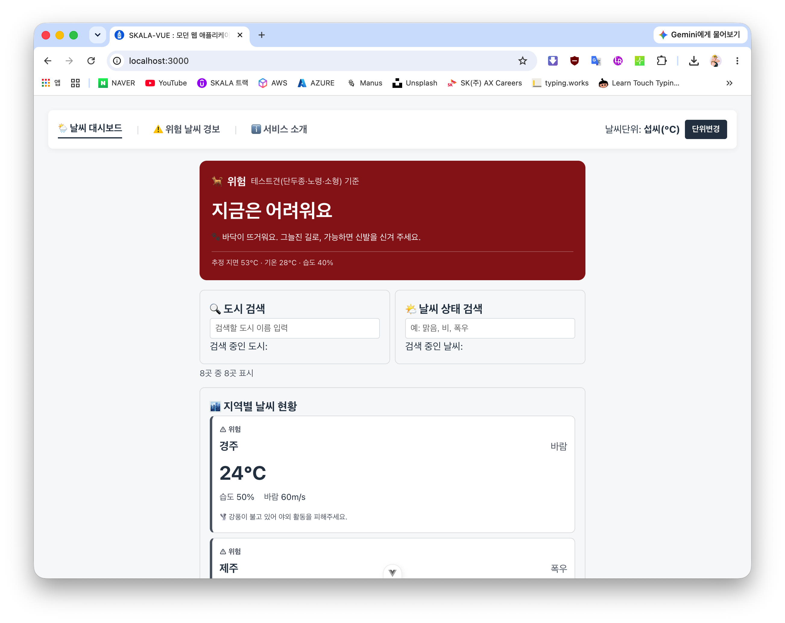
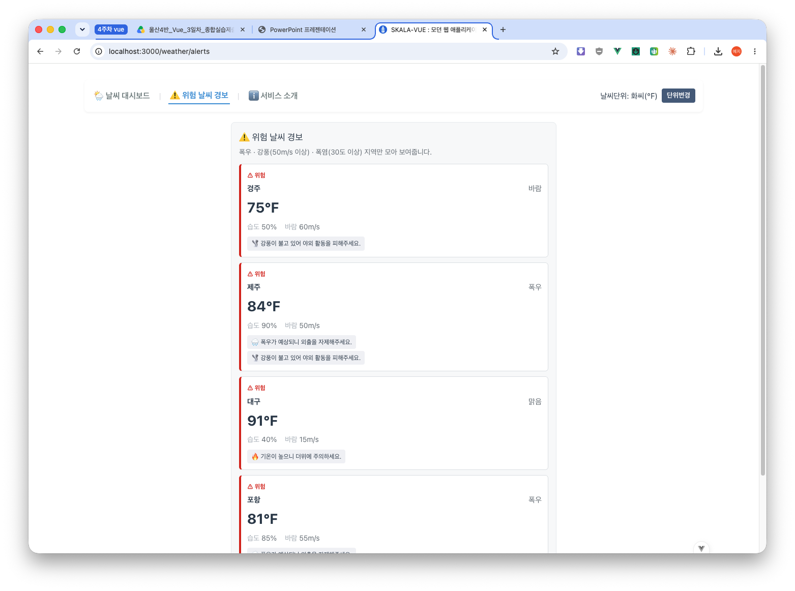
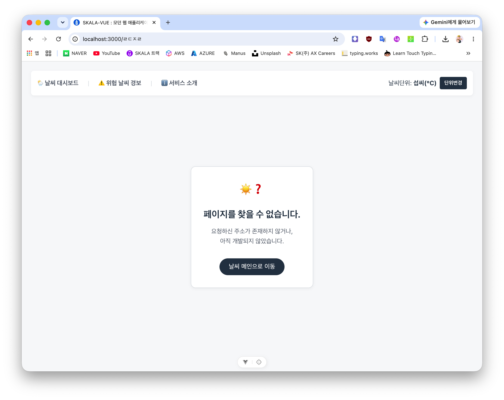

# Day 3 — Vue 날씨 대시보드 → 반려견 산책 판정 서비스 전환 기록

> **작업 순서**: 1. Component 분리 → 2. Vue Router 적용 → 3. Pinia Store 배치 → 4. 컨셉 전환(반려견 산책 판정) + 디자인 토큰 확립 + 로딩/오류 상태 배치
> 각 단계별 요구사항, 변경점, 설계 판단, 버그 수정, 검증 방법을 정리했다.

---

# 1단계 — Component 분리 (Vue Components)

## 과제 요구사항

1. `WeatherParent.vue` — 모든 반응형 데이터 유지 (컨테이너 역할)
2. `BaseDashboardCard.vue` — 검색박스와 리스트박스의 디자인을 공통화. `<slot>` 배치하여 부모가 도시 검색, 날씨 현황 주입
3. `SearchBar.vue` — 부모로부터 검색도시 반응형 데이터를 전달받아 표시(props). 도시 검색 시 `update-query` 이벤트를 발생시켜 검색어를 부모에게 전달(emits)
4. `WeatherCard.vue` — 선택된 도시 객체를 전달받아 표시(props). 카드 선택(`select-card`)과 상세보기(`click-detail`) 이벤트를 부모에게 전달(emits)
5. 각 컴포넌트의 디자인은 `<style scoped>`로 각각 분리
6. Slot으로 전달되는 자식 컴포넌트는 시각적으로는 `BaseDashboardCard` 내부에 위치하지만, 스크립트적으로는 부모(`WeatherParent`) 스코프에서 컴파일되므로 직접 바인딩/통신이 가능하다
7. 추가로 Component를 더 분리하여 추가 Component를 만든다

## 최종 컴포넌트 구조

``` 
WeatherParent.vue            ← 상태/로직 소유자 (컨테이너)
├─ BaseDashboardCard.vue     ← 레이아웃 껍데기 (slot만 있음)
│   └─ SearchBar.vue         ← 도시 검색 입력 (범용화됨)
├─ BaseDashboardCard.vue
│   └─ SearchBar.vue         ← 날씨 상태 검색 입력 (같은 컴포넌트 재사용)
├─ BaseDashboardCard.vue
│   ├─ (위험 필터 체크박스)   ← 부모 템플릿에 인라인 유지
│   └─ WeatherList.vue       ← 목록 순회 + 빈 결과 상태
│       └─ WeatherCard.vue   ← 리스트 아이템 (카드 1개)
│           └─ WeatherBadge.vue  ← 온도/추천 뱃지 규칙
└─ StatusBar.vue             ← 하단 알림 문구
```

## 분리 기준

컴포넌트 경계를 정할 때 4가지 질문을 기준으로 했다.

1. **상태/로직 소유권** — 이 조각이 반응형 상태(`ref`/`computed`/`watch`)를 스스로 가져야 하는지, 혹은 부모가 준 데이터를 그리기만 합니까?
   → 상태를 갖는 건 `WeatherParent` 하나뿐이고, 나머지는 전부 `props`로 받아 `emit`으로 올리는 무상태(presentational) 컴포넌트이다.
2. **반복되는 시각적 뼈대** — 데이터와 무관하게 스타일/구조만 반복되는지?
   → `BaseDashboardCard`. props/emit이 전혀 없어 첫 번째로 안전하게 뗄 수 있었다.
3. **`v-for`로 반복되는 리스트 아이템** — 배열의 원소 하나를 그리는 단위인지?
   → `WeatherCard`(카드 한 장), 그리고 카드들을 순회하며 빈 상태까지 책임지는 `WeatherList`.
4. **복잡한 조건부 규칙이 독립적으로 존재** — 하나의 컴포넌트가 "레이아웃"과 "판정 로직" 두 책임을 동시에 갖고 있지 않은지?
   → `WeatherCard` 안에 있던 7단짜리 `v-if/v-else-if` 뱃지 판정 체인을 `WeatherBadge`로 분리해, `WeatherCard`는 카드 레이아웃만, `WeatherBadge`는 추천 규칙만 갖게 했다.

## "새로 만들지 않기"로 판단한 기준

- **똑같이 생긴 UI가 2번 나오면, 새 컴포넌트보다 기존 컴포넌트를 범용화** — 도시 검색창과 날씨 상태 검색창은 구조가 동일해서 `SearchBar`를 복제하지 않고 `label`/`placeholder`/`hint-label` prop을 추가해 재사용했다.
- **로직이 한 줄이라 유지** — 위험 날씨 필터 체크박스는 `v-model` 한 줄뿐이라 별도 컴포넌트로 만들지 않고 `WeatherParent` 템플릿에 인라인으로 남겼다. (과설계 방지)

## 작업 순서

리스크가 낮은 것부터, 상태 의존성이 낮은 것부터 뗐다.

1. **`BaseDashboardCard`** : props/emit 없음. 구조만 바꾸는 작업이라 로직을 건드릴 위험이 없어 첫 번째로 진행.
2. **`WeatherCard`** : `v-for` 블록을 떼어서 `cityItem` prop 하나로 경계를 좁힘. `select-card`/`click-detail` 이벤트 계약을 이 시점에 확정.
3. **`SearchBar`** : `currentQuery` prop + `update-query` emit으로 "props down, events up" 계약을 명시적으로 세움.
4. **`WeatherParent`로 조립** : 세 컴포넌트를 import하고 남은 상태/로직은 유지한 채 템플릿만 컴포넌트 태그로 교체.
5. **추가 분리: `StatusBar` / `WeatherBadge` / `WeatherList`** : "아직 어디에도 안 들어간 것"(하단 알림 문구)과 "기존 컴포넌트가 책임을 2개 이상 가진 곳"(카드 안의 뱃지 판정 체인, 부모 템플릿의 v-for+빈 상태)을 추가로 분리.
6. **기능 전체 이식** : 날씨 상태 검색(`statusQuery`), 위험 날씨 필터(`showDangerOnly`), 8개 도시 전체 데이터, 2단 `computed` 체인(`filteredWeatherList` → `displayWeatherList`)을 추가.

## 파일별 변경 요약

| 파일                           | 변경 내용                                                                                                                                                                                                                                                                                                     |
| ------------------------------ | ------------------------------------------------------------------------------------------------------------------------------------------------------------------------------------------------------------------------------------------------------------------------------------------------------------- |
| `WeatherParent.vue`            | `weatherList`를 8개 도시 전체 데이터로 복원. `statusQuery`, `showDangerOnly` 상태와 `filteredWeatherList`→`displayWeatherList` computed 체인, `showDangerOnly` watch 로그 복원. 템플릿에 상태 검색용 `SearchBar` 추가, `list-header`(제목+위험 필터 체크박스) 추가, `WeatherList`에 `displayWeatherList` 연결 |
| `BaseDashboardCard.vue` (신규) | props/emit 없는 레이아웃 껍데기. `<slot>`만 있음                                                                                                                                                                                                                                                              |
| `SearchBar.vue` (신규)         | `label`/`placeholder`/`hintLabel` prop 추가로 범용화. 도시 검색과 날씨 상태 검색 두 곳에서 재사용                                                                                                                                                                                                             |
| `WeatherCard.vue` (신규)       | `cityItem` prop 하나로 경계를 좁힘. `select-card`/`click-detail` 이벤트 emit. 인라인 뱃지 로직은 `WeatherBadge`로 분리 예정                                                                                                                                                                                   |
| `WeatherList.vue` (신규)       | `list` prop을 순회하며 `WeatherCard` 렌더링, 빈 결과 메시지("😭 조건에 맞는 결과가 없습니다.") 처리, `select-card`/`click-detail` 이벤트를 그대로 상위로 전달                                                                                                                                                 |
| `WeatherBadge.vue` (신규)      | `status`/`temp`/`humidity`/`windSpeed` prop으로 온도감 뱃지 + 활동 추천 문구 계산. `WeatherCard`의 조건부 렌더링 책임을 분리                                                                                                                                                                                  |
| `StatusBar.vue` (신규)         | `message` prop만 받아 하단 알림바 렌더링. 상태 없음                                                                                                                                                                                                                                                           |

## 검증 방법

`npm run dev`로 로컬 서버를 띄운 뒤 브라우저에서 확인:

- 도시 검색 / 날씨 상태 검색 입력 시 목록이 올바르게 필터링되는지
- 위험 날씨만 보기 체크박스로 목록이 좁혀지는지 ("폭우" 검색 + 위험 필터 동시 적용 시 제주/포항만 남는 것까지 확인)
- 카드 클릭 시 하단 `StatusBar` 문구가 갱신되는지
- 상세보기 클릭 시 습도/바람 세기가 포함된 알림창이 뜨는지
- 콘솔에 에러 없이 `watch`/`watchEffect` 로그가 정상 출력되는지

---

# 2단계 — Router 적용 (Vue Router)

## 과제 요구사항

1. **Vue Router 설정** — 라우터 지연 로딩 적용, Catch-all Route 적용
2. **App.vue** — Navigation Bar 추가 (`RouterLink`) 및 메인 콘텐츠 영역 배치 (`RouterView`)
3. **WeatherHomeView.vue** — `WeatherParent` 대체 (`/` 경로). 상세보기 버튼 클릭 시 `window.alert()`를 제거하고 Programmatic Navigation 처리 (`router.push('/weather/' + id)`)
4. **WeatherDetailView.vue** — 지역별 상세 기상관측 정보. 도시 코드에 해당하는 Mock Data를 임시로 활용. 동적 경로 매칭 `cityId`를 기반으로 Mount 시점에 Mock Data에서 도시 객체 선택
5. **WeatherAboutView.vue** — 적당한 내용 작성 및 메인 대시보드로 돌아가기 작성
6. **추가 view 작성 및 Routing** — 본인만의 추가 view를 작성하고 라우팅

## 최종 라우팅 구조

| Path               | Name            | Component               | Lazy | 비고                                   |
| ------------------ | --------------- | ----------------------- | ---- | -------------------------------------- |
| `/`                | `WeatherHome`   | `WeatherHomeView.vue`   | ❌   | 초기 진입점, 즉시 로드                 |
| `/weather/alerts`  | `WeatherAlerts` | `WeatherAlertView.vue`  | ✅   | 위험 날씨 경보 전용 페이지 (추가 view) |
| `/about`           | `WeatherAbout`  | `WeatherAboutView.vue`  | ✅   | 서비스 소개                            |
| `/weather/:cityId` | `WeatherDetail` | `WeatherDetailView.vue` | ✅   | 동적 세그먼트, 상세보기                |
| `/:pathMatch(.*)*` | `NotFound`      | `NotFoundView.vue`      | ✅   | Catch-all                              |

`/weather/alerts`는 `/weather/:cityId`보다 위에 선언했다. Vue Router는 static 세그먼트를 dynamic보다 우선 매칭하므로 순서 자체가 동작에 영향을 주진 않지만, 가독성을 위해 더 구체적인 라우트를 위에 뒀다.

## 새 뷰 분리 기준

기존 화면 안의 기능들 중 "별도 URL로 뽑을 가치가 있는가"를 다음 기준으로 판단했다.

1. **북마크/공유가 의미 있는 독립된 결과 집합인가** — 필터링된 결과 자체가 하나의 화면 목적이 되는지.
2. **기존 컴포넌트를 그대로 재사용해 새 페이지를 구성할 수 있는가** — 새 컴포넌트를 만들지 않고 뷰 레벨에서만 분리 가능한지.
3. **같은 데이터셋에 대한 단순 필터인가, 아니면 성격이 다른 화면인가** — 후자만 분리 대상.

| 후보                                      | 판단      | 이유                                                                                                                                        |
| ----------------------------------------- | --------- | ------------------------------------------------------------------------------------------------------------------------------------------- |
| 위험 날씨 경보 (`/weather/alerts`)        | ✅ 채택   | 체크박스 필터로 Home에 끼워 넣기보다, 북마크 가능한 독립 결과 화면으로 승격하는 게 더 적합. `WeatherList`/`WeatherBadge` 그대로 재사용 가능 |
| 도시 비교 (`/weather/compare?cities=...`) | ⏸ 보류    | Path param vs Query string을 대비한 좋은 후보지만, 선택 UI를 새로 설계해야 해서 작업량이 더 큼 — 다음 단계로 미룸                           |
| 날씨 상태 검색 SearchBar                  | ❌ 비채택 | 도시 검색과 동일한 리스트/데이터셋을 걸러내는 필터일 뿐, 독립된 화면 목적이 없어 Home 컴포넌트로 유지                                       |

## 작업 순서

1. **현재 라우팅 현황 분석** — 기존 `router/index.js`, `App.vue`, `views/*`, `WeatherParent.vue`를 읽고 구현/미구현 목록 정리
2. **새 뷰 후보 검토** — 위 기준으로 위험 날씨 경보 뷰를 우선 채택, 도시 비교 뷰는 보류
3. **공용 mock 데이터 추출** — `weatherMockData.js`로 분리 (`weatherMockList`, `isDangerWeather` 판정 함수 포함). Home/Alert/Detail 세 뷰가 공유
4. **WeatherHomeView 기능 보강** — 상태 검색 SearchBar 복원, `WeatherList`/`StatusBar` 사용으로 교체, 8개 도시 데이터 복원, 검색어/상태어 쿼리스트링(`?search=&status=`) 동기화
5. **버그 수정 — `WeatherCard` 이벤트 계약** — `WeatherList`를 경유하면 `click-detail` 이벤트가 `(name, status, humidity, windSpeed)`만 전달되고 `id`가 빠져 있어 라우팅이 불가능했음. `id`를 마지막 인자로 추가하는 방식으로 수정
6. **WeatherAlertView 신규 작성** — `isDangerWeather` 조건(폭우 / 강풍 60m/s↑ / 폭염 30도↑)으로 필터링한 목록을 `WeatherList`/`StatusBar`로 렌더링, 상세보기는 동일하게 `router.push`
7. **라우터에 `/weather/alerts` 추가** — `/weather/:cityId`보다 위에 선언, lazy import 적용
8. **버그 수정 — WeatherDetailView mock 데이터** — Home이 8개 도시로 늘어나면서 기존 3개 도시만 있던 상세 페이지 mock으로는 나머지 5개 도시가 "데이터 없음"으로 뜨는 문제 발견. 공용 mock 데이터 기반으로 8개 도시 전체를 커버하도록 재작성
9. **App.vue 내비게이션에 경보 링크 추가** — nav bar에 `⚠️ 위험 날씨 경보` `RouterLink` 추가
10. **브라우저 검증**

## 파일별 변경 요약

| 파일                          | 변경 내용                                                                                                                                                                              |
| ----------------------------- | ---------------------------------------------------------------------------------------------------------------------------------------------------------------------------------------- |
| `weatherMockData.js` (신규)   | `weatherMockList`(8개 도시 전체 데이터) + `isDangerWeather` 판정 함수. Home/Alert/Detail 세 뷰가 공유                                                                                  |
| `WeatherAlertView.vue` (신규) | 위험 날씨만 필터링해 보여주는 전용 페이지. `WeatherList`/`StatusBar` 재사용                                                                                                            |
| `WeatherHomeView.vue`         | 상태 검색 SearchBar 추가, `WeatherList`/`StatusBar` 사용으로 교체, 8개 도시 데이터 복원, 쿼리스트링에 `status` 추가 동기화. 상세보기 버튼 `window.alert()` 제거 → `router.push`로 변경 |
| `WeatherDetailView.vue`       | mock 데이터를 공용 `weatherMockList` 기반으로 재작성해 8개 도시 전체 커버. 동적 경로 `cityId` 기반으로 Mount 시점에 도시 객체 선택                                                     |
| `WeatherAboutView.vue`        | 서비스 소개 내용 + 메인 대시보드로 돌아가기 링크                                                                                                                                       |
| `WeatherCard.vue`             | `click-detail` emit 마지막 인자로 `cityItem.id` 추가 (기존 4개 인자 순서는 유지)                                                                                                       |
| `router/index.js`             | `/weather/alerts` 라우트 추가 (lazy, `/weather/:cityId`보다 위). Catch-all 적용. 기존 라우트 지연 로딩 유지                                                                            |
| `App.vue`                     | Navigation Bar 추가 (`RouterLink`), 메인 콘텐츠 영역 `RouterView` 배치                                                                                                                 |

## 설계 판단: `weatherMockData.js`는 왜 Pinia store가 아닌 plain module인가

세 뷰가 같은 데이터를 공유한다는 점만 본다면 Pinia store가 먼저 떠오르지만, 판단 기준은 **"반응형으로 변경되고 그 변경이 여러 컴포넌트에 동기화돼야 하냐"**로 잡았다.

- **plain module로 충분한 이유**: `weatherMockList`는 어디서도 mutate되지 않는 정적 배열이다. ES 모듈은 import할 때마다 같은 참조를 돌려주므로 "여러 곳에서 같은 데이터를 본다"는 목적 자체는 이미 달성된다. Pinia가 주는 부가가치(반응형 상태, 변경 시 실시간 동기화, devtools 추적)를 하나도 활용하지 못하는 상태에서 store를 만드는 건 보일러플레이트만 늘리는 과설계라고 판단했다.
- **Pinia가 실제로 쓰인 사례와의 대조**: `stores/configStore.js` + `UnitToggler.vue`(섭씨/화씨 단위 토글)는 정확히 Pinia가 필요한 사례다. 단위를 어디서 바꾸든 모든 화면에 그 변경이 즉시 반영돼야 하기 때문.
- **재검토 조건**: "즐겨찾기 도시 토글", "실시간 API로 목록 갱신" 같이 상태를 실제로 변경하고 여러 뷰에 반영돼야 하는 기능이 생기면 그때 Pinia store로 옮기는 게 맞다.

## 검증 방법

`npm run dev`로 로컬 서버를 띄운 뒤 브라우저에서 확인:

- Home(`/`)에 8개 도시가 검색바 2개(도시/날씨 상태)와 함께 정상 렌더링되는지
- 상세보기 클릭 시 `/weather/city_01`처럼 올바른 `id`로 라우팅되고, 해당 도시의 실제 데이터가 상세 페이지에 표시되는지
- `/weather/alerts` 진입 시 위험 조건(폭우/강풍60↑/폭염30↑)에 해당하는 도시(경주·제주·대구·포항)만 남는지
- 네트워크 탭에서 `/weather/alerts` 방문 시점에 `WeatherAlertView.vue` 청크가 지연 로드되는지
- 콘솔에 에러 없이 정상 동작하는지

---

# 3단계 — Store 배치 (Pinia)

## 과제 요구사항

1. `configStore.js` 작성 — 날씨 단위 설정
   - `state`: `unit` (초기값: `celsius`)
   - `getters`: `unitSymbol` (현재 단위 상태에 맞는 기호: `℃` / `℉`)
   - `actions`: `toggleUnit` (`celsius`와 `fahrenheit`를 토글)
2. `UnitToggler.vue` — 대시보드 상단에 배치되어 단위 설정을 변경하는 UI 버튼과 영역
3. Navigation Bar 옆에 `UnitToggler.vue` 배치
4. 메인과 상세 날씨에 단위 설정 변경 적용
5. **추가 Store 작성 및 활용** — `configStore`에서 state/getter/action을 추가하거나, 본인만의 추가 Store를 작성

## 추가 구현: 설계 문서 기반 구조 정리

`service_architecture.md` / `design_architecture.md` / `vue_architecture.md` 3개 설계 문서를 먼저 재작성한 뒤, 그 문서가 정한 마이그레이션 순서를 따라 코드를 실제로 옮겼다. 범위는 **Pinia 도입 전 구조 정리 전부** + **Pinia는 배치까지만**으로 한정했다.

## 작업 순서

1. **정리(cleanup)** — 학습 산출물 격리, 스캐폴드 삭제, 완전 중복 백업 삭제
2. **폴더 재편** — `components/exercise/` → `components/common/` + `components/weather/`
3. **도메인 계층 신설** — `src/domain/`, `src/composables/`
4. **컴포넌트 계약 수정** — `WeatherCard`/`WeatherList`/`WeatherBadge`의 emit·layout
5. **View 재작성** — Home/Alert/Detail이 store와 domain을 쓰도록
6. **App.vue 단일 셸화**
7. **Pinia 배치** — `weatherStore` 연결, `favoriteStore`/`authStore` 뼈대, `configStore` 소비 연결
8. **검증**

## 1. 정리 (Cleanup)

| 대상                                                                                                                                | 처리                                               | 이유                                                                                                                 |
| ----------------------------------------------------------------------------------------------------------------------------------- | -------------------------------------------------- | -------------------------------------------------------------------------------------------------------------------- |
| `WeatherMockup.vue` / `WeatherComposition.vue` / `WeatherParent.vue`, `App.vue.1st/.2nd/.3rd`                                       | `src/practices/weather-intro/`로 이동              | 학습 계보 기록. 삭제하면 계보가 끊긴다                                                                               |
| `stores/counter.js`                                                                                                                 | `src/practices/counter.js`로 이동                  | 실습용 Store가 실제 전역 상태 Store와 같은 폴더에 있으면 폴더 목록으로 "이 앱의 전역 상태가 무엇인가"를 답할 수 없다 |
| `components/HelloWorld.vue`, `TheWelcome.vue`, `WelcomeItem.vue`, `components/icons/*`, `views/HomeView.vue`, `views/AboutView.vue` | 삭제                                               | `npm create vue` 스캐폴드 산출물, 본인 작성 아님, 라이브 트리 어디서도 참조되지 않음                                 |
| `App.vue.old`, `router/index.js.old`                                                                                                | 삭제                                               | 다른 백업 파일과 바이트 단위로 완전 중복인 것을 `diff`로 확인 후 삭제                                                |
| `WeatherCard.vue.afterStore` / `.beforeStore`                                                                                       | `docs/reference/`로 이동, 확장자 `.vue.txt`로 변경 | 구현 참고자료로서 가치는 있으나, `.vue` 확장자로 두면 `defineProps` 반환값 미대입 등 결함이 검사 없이 방치된다       |

## 2. 폴더 재편

도메인 지식(날씨 필드·위험 규칙)을 아는지 여부로 `components/exercise/`를 분해했다.

| 새 위치               | 파일                                                                                              |
| --------------------- | ------------------------------------------------------------------------------------------------- |
| `components/common/`  | `BaseDashboardCard.vue`, `SearchBar.vue`, `StatusBar.vue`                                         |
| `components/weather/` | `WeatherList.vue`, `WeatherCard.vue`, `WeatherBadge.vue`, `UnitToggler.vue`, `weatherMockData.js` |

`exercise/` 폴더는 비워져 삭제됐다.

## 3. 도메인 계층 신설

| 파일                                       | 내용                                                                                                                                                                                                    |
| ------------------------------------------ | ------------------------------------------------------------------------------------------------------------------------------------------------------------------------------------------------------- |
| `src/domain/weatherRules.js` (신규)        | 위험 판정 임계값 상수(`DANGER_WIND_SPEED=50`, `DANGER_TEMP=30` 등) + `isDangerWeather()` + `getWeatherAdvice()`. 기존에 함수 1벌 + 템플릿 `v-if` 체인 1벌로 흩어져 있던 판정 규칙을 이 파일 하나로 합침 |
| `src/domain/temperature.js` (신규)         | `celsiusToFahrenheit()` 순수 함수. 기존에 두 곳에 복사돼 있던 공식을 이 파일 하나로 합침                                                                                                                |
| `src/composables/useTemperature.js` (신규) | `configStore.unit`을 구독해 `formatTemp()`/`unitSymbol`을 제공. Store에 변환 로직을 두지 않고, 컴포넌트마다 복사하지도 않는 절충안                                                                      |

`weatherMockData.js`는 이제 데이터만 갖는다. `isDangerWeather`는 더 이상 이 파일에서 export하지 않는다 — 데이터 파일과 판정 규칙은 수명이 다르기 때문(목업은 API 연동 시 사라지지만 판정 규칙은 남아야 한다).

## 4. 컴포넌트 계약 수정

### `WeatherCard.vue`

- **emit을 5개 위치 인자 → `cityId` 문자열 1개로 축소**하고 이름을 `click-detail` → `request-detail`로 변경. 기존에는 `(name, status, humidity, windSpeed, id)`를 별도로 보냈으나 수신부가 앞 4개를 버리는 코드를 써야 했다.
- **카드 전체 클릭 = 상세 이동**으로 통일. 기존에는 카드 클릭이 `select-card`(상태바 문구 변경)만 하고, 절대 위치로 얹힌 별도 버튼이 이동을 담당해 도시명과 겹칠 수 있는 구조였다.
- **레이아웃을 정보 위계에 맞게 재배치**: 위험 시 좌측 4px 빨간 테두리 + "⚠ 위험" 플래그를 카드 최상단에 고정, 도시명/상태를 한 줄로, 기온을 카드에서 가장 큰 글자(28px)로, 습도·풍속은 라벨을 흐리게 처리한 보조 정보로 배치.
- `useTemperature()`로 기온을 표시해, 단위 토글이 실제로 카드 숫자를 바꾸게 됐다.

### `WeatherBadge.vue`

- `status`/`temp`/`humidity`/`windSpeed` 개별 prop 대신 `cityItem` 객체 하나를 받고, 표시는 `domain/weatherRules.js`의 `getWeatherAdvice()` 결과를 그대로 렌더링만 한다.
- 조합 전용 문구("폭우+강풍 동시 발생!" 등)를 없애고, **위험 조건 1건당 문구 1개, 최대 2개까지 동시 노출**로 변경. 조건이 늘어도 조합 분기가 배로 늘지 않는다.
- 온도감 배지("🔥 더움 (25도 이상)")는 판정에 쓰이지 않는 표시였으므로 제거.

### `WeatherList.vue`

이벤트 패스스루를 `select-card`/`click-detail` 두 개에서 `request-detail` 하나로 단순화.

## 5. View 재작성

### `WeatherHomeView.vue`

- 세 View가 각각 `weatherMockData`를 직접 import하던 것을 **`weatherStore` 하나로 통일**.
- 검색 URL 동기화 방식 개선: 기존에는 타이핑 1글자마다 `router.push`로 히스토리가 쌓였고, 복원 로직은 `onMounted` + `KeepAlive` 전제였으나 실제 `KeepAlive`는 주석 처리돼 있어 코드와 동작 방식이 어긋나 있었다. 이제 **초기값은 setup 시점에 `route.query`에서 한 번만 읽고, 이후 변경은 `router.replace` + 300ms 디바운스**로 반영. `onMounted`/`KeepAlive` 의존을 제거.
- 필터된 목록을 **위험 지역이 상단에 오도록 정렬**(`isDangerWeather` 기준).
- 검색 결과 0건일 때 "검색 조건 초기화" 버튼 추가.

### `WeatherAlertView.vue`

`weatherStore.dangerCityList`(getter)를 그대로 렌더링하도록 변경. 안내 문구의 임계값을 `domain/weatherRules.js` 상수에서 직접 가져오도록 수정.

### `WeatherDetailView.vue`

- `mockDetails` 룩업 객체를 직접 만드는 대신 `weatherStore.findCityById()` 사용.
- **조회를 `onMounted` 1회에서 `computed(() => weatherStore.findCityById(route.params.cityId))`로 변경.** 기존 방식은 `/weather/city_01`에서 `/weather/city_02`로 파라미터만 바뀌며 이동하면(vue-router가 컴포넌트를 재사용하므로) `onMounted`가 다시 실행되지 않아 이전 도시 정보가 남는 버그가 있었다.
- 레이아웃 재배치: 돌아가기 버튼을 최상단으로, 위험 시 배지를 도시명보다 위에, 습도·풍속을 라벨:값 2열 정렬로 배치.
- 존재하지 않는 도시 안내 문구를 사용자 친화적으로 변경.
- `useTemperature()`로 기온을 표시.

## 6. `App.vue` 단일 셸화

기존 `App.vue`는 과제 1~5 다섯 섹션을 세로로 쌓아 한 페이지에 동시 렌더링했고, `<RouterView />`가 이름 없이 두 곳(과제4, 과제5 섹션)에 있어 **같은 라우트가 항상 두 인스턴스로 마운트**됐다(검색창 상태가 서로 어긋나고, 404 카드가 2개 뜨는 등). 이제 네비게이션 1개 + `<RouterView />` 1개인 단일 셸만 남겼다.

부수 정리: `.dashboard-wrapper`가 4개 파일에 `width: 600px` 고정으로 중복 선언돼 있던 것을 `exercise.css` 한 곳(`max-width: 640px; width: 100%`)으로 통합. `main.css`의 스캐폴드 기본값인 `@media (min-width: 1024px)` 2열 그리드도 제거 — 콘텐츠 성격과 무관하게 화면을 반으로 쪼개던 규칙이라 단일 셸 구조와 맞지 않았다.

## 7. Pinia 배치

> 요청 범위: "적용 배치까지만" — Store 구조를 세우고 화면에 연결하되, API 연동·인증 흐름·영속성 저장 같은 그 다음 단계는 손대지 않았다.

### Store 현황

| Store                            | 상태               | 내용                                                                                                                                                                                                                   |
| --------------------------------- | ------------------ | -------------------------------------------------------------------------------------------------------------------------------------------------------------------------------------------------------------------- |
| `stores/weatherStore.js` (신규)  | **연결 완료**      | `cities`, `listStatus`, `listError`, getter `dangerCityList`/`findCityById`, action `loadCityWeather`/`refreshCityWeather`. Home/Alert/Detail 세 View가 전부 이 Store를 통해서만 날씨 데이터를 읽는다                  |
| `stores/configStore.js`          | **소비 연결 완료** | `unit` (state), `unitSymbol` (getter), `toggleUnit` (action). `unitLabel` getter를 추가해 `UnitToggler.vue`의 중복 삼항식을 제거. `WeatherCard`/`WeatherDetailView`가 `useTemperature()`를 통해 실제로 이 Store를 구독 |
| `stores/favoriteStore.js` (신규) | **뼈대만**         | `favoriteCityIds`, `isFavorite`, `toggleFavorite` 등 구조만. 즐겨찾기 기능 자체가 화면에 없어 UI에는 연결하지 않음                                                                                                     |
| `stores/authStore.js` (신규)     | **뼈대만**         | `user`, `token`, `login`/`logout` 등 구조만. 로그인 화면·API가 없어 UI에는 연결하지 않음                                                                                                                               |

> 두 뼈대 Store(`favoriteStore`/`authStore`)는 4단계에서 소비처가 끝내 붙지 않아 삭제된다 — 자세한 이유는 [4단계 7절](#7-소비처-없는-store-삭제)을 참고.

### `UnitToggler.vue` 배치

- 대시보드 상단(Navigation Bar 옆)에 배치되어 단위 설정을 변경하는 UI 버튼과 영역
- `configStore.toggleUnit()`을 호출하여 `celsius` ↔ `fahrenheit` 전환
- `configStore.unitSymbol`을 표시하여 현재 단위 상태를 시각적으로 피드백

### `useTemperature()` Composable

과제 요구사항 4번(메인/상세 날씨에 단위 설정 변경 적용)에서 "유사한 코드가 중복됨 → Composable로 해결 가능함"이라는 힌트를 반영했다.

- `configStore.unit`을 구독해 `formatTemp()`/`unitSymbol`을 제공
- Store에 변환 로직을 두지 않고(원본 섭씨가 사라짐), 컴포넌트마다 복사하지도 않는 절충안
- `WeatherCard.vue`와 `WeatherDetailView.vue`가 모두 이 composable을 사용하여 단위 변경 시 숫자가 실시간으로 갱신됨

---

## 3단계 주요 버그 수정 및 설계 개선

### 1. 위험 판정 기준값 불일치

기존 `WeatherAlertView.vue`는 화면에 "강풍(60m/s 이상)"이라고 적혀 있었지만 실제 판정 코드는 `windSpeed >= 50`이었다. 데이터 8건 중 50~59 구간 도시가 마침 폭우 조건도 만족해 우연히 증상이 보이지 않았을 뿐이다. 이제 화면 문구가 `DANGER_WIND_SPEED` 상수를 직접 참조해 출력하므로, 값을 하나만 바꾸면 코드와 문구가 항상 같이 바뀐다.

### 2. 단위 토글이 화면에 반영되지 않던 문제

기존에는 `configStore.toggleUnit()`이 정상 동작했지만 `WeatherCard.vue`/`WeatherDetailView.vue`가 `°C`를 문자열로 하드코딩해 store를 구독하지 않았다 — 버튼을 눌러도 카드 숫자가 그대로였다. 이제 두 컴포넌트 모두 `useTemperature().formatTemp()`로 기온을 표시해 **단위변경 버튼이 실제로 화면 숫자를 바꾼다.** 단, 위험 판정(`isDangerWeather`)은 항상 섭씨 원본 값으로만 계산하도록 유지 — 화씨로 표시를 바꿔도 어떤 도시가 위험 판정을 받는지는 변하지 않는다.

### 3. `WeatherCard` 이벤트 계약 불일치

`WeatherList`를 경유하면 `click-detail` 이벤트가 `(name, status, humidity, windSpeed)`만 전달되고 `id`가 빠져 있어 라우팅이 불가능했었다. 이를 `cityId` 단일 인자로 축소하여 해결.

### 4. `WeatherDetailView` 라우트 파라미터 변경 시 데이터 미갱신

기존 방식은 `onMounted` 1회 조회였는데, vue-router가 컴포넌트를 재사용하면 `onMounted`가 다시 실행되지 않아 이전 도시 정보가 남는 버그가 있었다. `computed` 기반 조회로 변경하여 해결.

---

# 4단계 — 컨셉 전환(범용 날씨 → 반려견 산책 판정) + 디자인 토큰 확립 + 로딩/오류 상태 배치

> 3단계 제출본(Pinia 배치까지 끝난 상태) 대비 변경점만 기록한다. 이번 작업은 새 기능을 얹은 게 아니라 **설계 문서 3종을 먼저 개정하고, 그 문서가 정한 범위만큼만 코드를 옮긴** 것이다. 범위는 `vue_architecture.md` 10절 마이그레이션 계획의 **1~2단계**(`domain/walkRules.js` 신설 + `WalkVerdictCard` 1개를 홈 상단에 하드코딩 배치)와 **8~9단계에 해당하는 디자인 토큰·로딩/오류 상태 정착**으로 한정했다. 견종 프로필 입력, 지면온도 실측, 라우트 재편, API 계층은 이번 범위 밖이다.

## 작업 순서

1. **설계 문서 3종 개정** — `service_architecture.md`(컨셉 전환) / `design_architecture.md`(토큰·강조 위계) / `vue_architecture.md`(계층·마이그레이션 계획)
2. **디자인 토큰 확립** — `base.css`를 색상 리터럴 0건 상태로 재작성
3. **도메인 로직 신설** — `src/domain/walkRules.js`
4. **`WalkVerdictCard` 배치** — `WeatherHomeView.vue` 상단에 검증용 하드코딩 프로필로 연결
5. **강조 위계 재조정** — `WeatherCard`/`WeatherBadge`/`WeatherList`에 `emphasis` prop 도입
6. **로딩/오류 상태 실제 연결** — `ErrorState.vue`/`WeatherCardSkeleton.vue` 신설, 세 View에 배치
7. **소비처 없는 Store 삭제** — `favoriteStore.js`/`authStore.js` 제거
8. **레이아웃 CSS 정리** — `exercise.css` → `layout.css` 개명, 죽은 규칙 폐기
9. **검증**

## 1. 설계 문서 3종 개정 — 컨셉 전환

### 왜 바꿨는가 (`service_architecture.md` 1.1~1.4)

기존 컨셉("지금 밖에 나가도 되는지 대신 판단해 주는 날씨 서비스")은 주어가 비어 있어 **어떤 기능이든 채택 근거를 댈 수 있었다**(예: 대기질 기능의 채택 근거가 "판단 근거 추가"라는 동어반복이었음). 판정 구조(입력→판정→행동 권고) 자체는 유지한 채 대상만 **반려견 산책 가능 여부**로 좁혔다 — 피벗이 아니라 상속이다. "범용 판정 + 견주 모드" 하이브리드는 판정 주체가 둘이 되고 화면당 최강 강조 1개 규칙([design_architecture.md] 2.6)을 어겨 채택하지 않았다(1.4).

### 신규 기능 등급 (`service_architecture.md` 3.4)

F-23(산책 가능 판정) ~ F-29(다견 대상 전환)를 새 기능으로 추가하고, 기존 F-01~F-22는 "승계 기능"으로 재분류했다. 이번 배치 범위에 실제로 코드가 반영된 것은 **F-23(산책 판정)만**이며, 나머지(F-25 지면온도, F-27 프로필, F-28 견종 정규화 등)는 `[예정]`으로 문서에만 존재한다.

### 문서 구조 변화

세 문서 모두 절 번호를 하위 항목까지 세분화(`1.` → `1.1/1.2/…`)하고 각 항목에 `[현재]`/`[예정]`/`[결정 필요]` 상태 표기를 달았다. `design_architecture.md`는 "2.5 지면온도의 예외 취급", "4.2 WalkVerdictCard", "5.3 신규 — 산책 단계 색"이, `vue_architecture.md`는 "4.5 dogStore", "5.2 산책 판정의 소유권", "8.2 목표 라우트"가 새로 생겼다.

## 2. 디자인 토큰 확립 — `base.css` 전면 재작성

기존 `base.css`는 Vue 스캐폴딩 기본 팔레트(`--vt-c-*`)를 그대로 썼다. 이를 **역할 이름 기반 토큰**으로 교체했다(`design_architecture.md` 5.1 — `--color-red`가 아니라 `--color-danger`로 지어, 임계값이 바뀌어 위험 배정이 달라져도 변수명을 다시 지을 필요가 없게 함).

| 구분        | 내용                                                                                                                                                                                                                                     |
| ----------- | ------------------------------------------------------------------------------------------------------------------------------------------------------------------------------------------------------------------------------------ |
| 색          | `surface`/`border`/`text`(중립), `danger`/`warning`/`safe`/`info`(의미색, 채움+표면 쌍), `primary`(브랜드 대용), **`walk-good`/`walk-caution`/`walk-limited`/`walk-unsafe`(산책 4단계 — 위험도 축과 다른 별도 축이라 danger/warning/safe를 재사용하지 않음, 1차 잠정치)** |
| 타이포      | `--font-sans`, `--font-size-xs~2xl`(7단계)                                                                                                                                                                                             |
| 간격        | `--space-1~8`(4px 배수 스케일)                                                                                                                                                                                                         |
| 반경/그림자 | `--radius-sm/md/lg/full`, `--shadow-sm/md`                                                                                                                                                                                             |

다크 모드 값도 전 토큰에 대해 함께 정의했다. 이후 모든 컴포넌트(`BaseDashboardCard`/`StatusBar`/`UnitToggler`/`WeatherBadge`/`WeatherCard`/`WeatherList`/`NotFoundView`/`WeatherAboutView`/`WeatherAlertView`/`WeatherDetailView`)의 색·간격·반경 리터럴을 전부 이 토큰 참조로 교체했다 — 라이브 컴포넌트에 색 리터럴 0건.

## 3. 도메인 로직 신설 — `src/domain/walkRules.js`

Vue를 모르는 순수 함수로, 판정 함수는 이 파일 1곳에만 존재한다(`service_architecture.md` 4.1). 견종 이름 자체는 모르며(견종→특성 변환은 `[예정]`인 `domain/breeds.js` 몫), `traits`(단두종 여부·피모 타입·체중군·연령군)와 `weather`, `groundTempCelsius`를 입력받는다.

- **임계값**: `GROUND_TEMP_UNSAFE=51℃` / `GROUND_TEMP_CAUTION=44℃`(피부 화상 역학 고전 참조치 Henriques 1947 + AKC/AAHA 소비자 가이드 + 국내 정책브리핑 교차 검증), `AIR_TEMP_CAUTION=29℃`(AKC·AAHA 공동 가이드), `HUMID_THRESHOLD=80%`(캐닌 열스트레스 연구 공통 소견). 모두 사람/소비자 가이드 기반 1차 근거이며 수의학 원저로 교체하는 것은 `[결정 필요]`로 남겨뒀다.
- **판정 로직**: `assessWalk({ weather, traits, groundTempCelsius })` → `{ level, maxMinutes, reasons }`. `level`은 `good/caution/limited/unsafe` 4단계로 단조 상승(`escalate`)하며, 취약 개체(단두종·이중모·비성견)는 같은 조건에서 한 단계 더 보수적으로 판정한다. `reasons`는 조건 1건당 1개, 우선순위(지면온도 > 강수·강풍 > 기온·습도)로 push 후 최대 2개까지만 반환한다 — 조합 전용 문구를 만들지 않아 조건이 늘어도 분기가 배로 늘지 않는다.
- **문구**: `getWalkAdvice(verdict)`가 `reasons`를 아이콘+지시문으로 변환한다. 위험 0건이어도 "지금 산책하기 좋아요!" 문구 1개는 항상 노출해 판정이 돌았다는 것을 확인시킨다. "괜찮습니다" 같은 단정적 문구는 쓰지 않는다(`service_architecture.md` 11절 — 수의학적 판단 배제).

## 4. `WalkVerdictCard` 배치 — `WeatherHomeView.vue`

마이그레이션 1~2단계 검증 목적으로, 홈 화면 최상단에 배치했다. **판정 문구가 실제로 쓸모 있는지 확인하는 것이 목적**이라 프로필·위치·지면온도는 전부 하드코딩했고(`PLACEHOLDER_DOG`), 각각의 정식 자리(3단계 `dogStore`, 5단계 `domain/groundTemp.js`, 위치 연동)로 옮기는 것은 다음 단계로 명시적으로 미뤘다.

- 지면온도 실측 API(기상청 도로기상관측자료)는 고속도로 366개 관측점뿐이라 커버리지가 부족해, 날씨 상태별 오프셋으로 추정하는 `estimateGroundTempPlaceholder()`를 임시로 뒀다 — `groundTemp.js`가 생기면 이 함수는 삭제되고 "실측 우선, 없으면 추정으로 폴백"하는 이중 구조로 교체된다.
- `WalkVerdictCard.vue`(신규, `components/walk/`)는 화면에서 **유일하게 배경이 채워진 요소**로 설계했다(`design_architecture.md` 2.6, 4.2 — 이 화면의 최강 강조). 판정 결과(`verdict`)는 객체 통째로 전달한다 — `level`/`maxMinutes`/`reasons`가 함께 움직이는 하나의 결과라 분해해서 넘기면 서로 어긋난 조합이 타입상 가능해지기 때문(`vue_architecture.md` 7.2).

## 5. 강조 위계 재조정 — `emphasis` prop

`WalkVerdictCard`가 화면의 최강 강조를 가져가면서, 기존에 목록의 위험 배지·좌측 빨간 테두리가 같은 화면에서 또 한 번 최강 강조를 주장하던 문제가 생겼다. `WeatherList → WeatherCard → WeatherBadge`에 `emphasis: 'primary' | 'muted'` prop을 관통시켜, 홈 화면 목록만 `emphasis="muted"`로 강등했다(위험 배지는 배경 채움 없는 무채색 텍스트로, 좌측 테두리는 회색으로 대체). 경보·상세 화면은 기존 `primary`를 유지해 그대로 위험을 강조한다.

## 6. 로딩/오류 상태 실제 연결

`weatherStore.listStatus`/`listError`는 3단계에 이미 store에 존재했지만 화면에 소비되지 않고 있었다. 이번에 신설한 2개 컴포넌트로 세 View 모두에 실제로 연결했다.

| 컴포넌트(신규)              | 역할                                                                                                                                             |
| ---------------------------- | ------------------------------------------------------------------------------------------------------------------------------------------------ |
| `WeatherCardSkeleton.vue`   | `listStatus === 'loading'`일 때 표시. 실제 카드와 같은 padding·radius를 써서 로딩→카드 전환 시 레이아웃이 밀리지 않게 함. `prefers-reduced-motion` 대응 |
| `ErrorState.vue`            | `listStatus === 'error'`일 때 표시. "검색 결과 0건"과 "통신 실패"가 같은 문구로 섞이지 않도록 빈 결과(`empty-state`)와 별도 컴포넌트로 분리. `retry` 이벤트로 `weatherStore.refreshCityWeather()` 재호출 |

`WeatherHomeView`/`WeatherAlertView`/`WeatherDetailView` 세 곳 모두 `loading → error → (success) 목록/상세` 순서의 분기 템플릿을 갖게 됐다.

## 7. 소비처 없는 Store 삭제

`favoriteStore.js`/`authStore.js`를 삭제했다. 3단계에는 "뼈대만" 만들어 둔 상태였는데, 소비 컴포넌트가 0개로 남아 있는 것 자체가 `vue_architecture.md`가 반면교사로 드는 실패 패턴("store는 완성됐는데 소비처가 안 붙어 완성된 것처럼 보이지만 동작 안 하는 기능")과 같았다. 새 컨셉에서 인증은 우선순위가 낮아졌고(P2), 즐겨찾기는 반복 대상이 "도시"에서 "개체"로 바뀌며 대체될 예정이라 지금 되살리지 않았다 — **소비처 없는 Store를 미리 만들지 않는다**는 원칙을 재확인했다.

## 8. 레이아웃 CSS 정리

`assets/exercise.css`를 `assets/layout.css`로 개명했다. 실습용 이름("exercise")에 서비스 핵심 레이아웃(네비게이션 바, 대시보드 폭)이 얹혀 있던 것을 내용에 맞는 이름으로 바로잡았고, `App.vue`의 import도 함께 바꿨다. 개명과 함께 실습 잔재였던 죽은 규칙(`.app-container`, `.badge`류, `.btn-detail`, `.weather-card` 등 — 이미 각 컴포넌트로 옮겨져 더는 쓰이지 않는 선택자)은 옮기지 않고 폐기했다. `main.css`도 스캐폴딩 잔재(`.green` 링크 스타일)를 제거하고 `#app` padding을 반응형 토큰으로 교체했다. `index.html`의 `<html lang="">`도 `lang="ko"`로 채웠다.

## 검증

- `base.css`/`layout.css` 기준 라이브 컴포넌트에 색 리터럴 0건 확인
- 홈 화면 최상단에 `WalkVerdictCard`가 렌더링되고, 판정 단계(좋음/주의/제한/위험)에 따라 배경색과 문구·가능 시간이 바뀌는지 확인
- 홈 목록의 위험 카드가 더 이상 배경/좌측 테두리로 경보와 동일한 강조를 갖지 않는지(무채색으로 강등) 확인
- `weatherStore.listStatus`를 `loading`/`error`로 강제했을 때 세 화면 모두 스켈레톤/오류 상태가 표시되고, `ErrorState`의 "다시 시도" 클릭 시 `refreshCityWeather()`가 호출되는지 확인
- `favoriteStore`/`authStore`를 참조하는 코드가 없는지 grep으로 재확인
- `npm run build` 정상 빌드

---

## 최종 파일 구조

```
src/
├─ components/
│   ├─ common/
│   │   ├─ BaseDashboardCard.vue
│   │   ├─ SearchBar.vue
│   │   ├─ StatusBar.vue
│   │   ├─ ErrorState.vue          ← 4단계 신규
│   │   └─ WeatherCardSkeleton.vue ← 4단계 신규
│   ├─ weather/
│   │   ├─ WeatherList.vue
│   │   ├─ WeatherCard.vue
│   │   ├─ WeatherBadge.vue
│   │   ├─ UnitToggler.vue
│   │   └─ weatherMockData.js
│   └─ walk/                       ← 4단계 신규
│       └─ WalkVerdictCard.vue
├─ views/
│   ├─ WeatherHomeView.vue
│   ├─ WeatherAlertView.vue
│   ├─ WeatherDetailView.vue
│   ├─ WeatherAboutView.vue
│   └─ NotFoundView.vue
├─ domain/
│   ├─ weatherRules.js
│   ├─ temperature.js
│   └─ walkRules.js                ← 4단계 신규
├─ composables/
│   └─ useTemperature.js
├─ stores/
│   ├─ weatherStore.js
│   └─ configStore.js
│   (favoriteStore.js / authStore.js — 4단계에서 삭제)
├─ assets/
│   ├─ base.css                    ← 4단계 전면 재작성 (토큰화)
│   ├─ main.css
│   └─ layout.css                  ← 4단계 개명 (구 exercise.css)
├─ router/
│   └─ index.js
├─ App.vue
└─ main.js

markdown/
├─ service_architecture.md         ← 4단계 개정
├─ design_architecture.md          ← 4단계 개정
├─ vue_architecture.md             ← 4단계 개정
└─ day3-4_readme.md
```

---

## 검증 방법 (종합)

1. `npx eslint src` — 0 errors (기존에 있던 무관한 warning 2건 제외)
2. `npm run build` — 정상 빌드
3. 브라우저로 5개 라우트 전부 확인:
   - 홈(`/`) — 상단 `WalkVerdictCard` 렌더링, 그 아래 8개 도시, 검색바 2개(도시/날씨 상태), 위험 정렬, 빈 결과, 검색어 URL 동기화
   - 상세(`/weather/:cityId`) — 존재/미존재 도시, 단위 토글, 습도/풍속 표시
   - 경보(`/weather/alerts`) — 위험 조건에 해당하는 도시만 노출, `primary` 강조 유지
   - 소개(`/about`) — 정상 렌더링
   - 404 — catch-all 정상 동작
4. 네트워크 탭에서 `/weather/alerts` 방문 시점에 `WeatherAlertView.vue` 청크가 지연 로드되는지 확인
5. 콘솔 에러 없음, 네비게이션/RouterView 중복 렌더링 사라짐 확인
6. 검색어 입력 시 URL이 `router.replace`로 반영되고(`?search=제주`), 히스토리가 쌓이지 않는 것 확인
7. 단위 토글 버튼 클릭 시 메인 카드와 상세 페이지의 온도 숫자가 실시간으로 변경되는지 확인
8. `weatherStore.listStatus`를 `loading`/`error`로 강제해 세 화면 모두 스켈레톤/오류 상태 및 재시도 동작 확인
9. `base.css`/`layout.css` 기준 라이브 컴포넌트 색 리터럴 0건, `favoriteStore`/`authStore` 참조 0건 grep 확인

---

## 남은 이슈 (다음 작업 후보 — `vue_architecture.md` 10절 마이그레이션 계획 3~10단계)

- `domain/breeds.js` + `DogProfileForm` + `dogStore`(메모리) — 견종 입력이 실제로 판정을 바꾸도록 연결(3단계)
- 프로필 localStorage 영속화(4단계) — 이 시점부터 컨셉을 되돌리는 비용이 커짐
- `domain/groundTemp.js` + `PawTempIndicator` — 지면온도 추정을 `WeatherHomeView`의 임시 함수에서 정식 도메인 함수로 교체(5단계)
- 예보 mock + `WalkWindowTimeline` — "다음 가능 시각" 표시(6단계)
- 라우트 재편(`/` → 산책 판정, `/weather`로 기존 목록 이동, Navigation Guard)(7단계)
- `api/` 계층 신설, mock → API 교체(8단계)
- 산책 단계 색 토큰의 다크 모드 실측 대비비 재검토(현재 1차 잠정치)(9단계)
- 접근성 마감 — `focus-visible`, `label for`, 헤딩 순서(10단계)
- 도시 비교 뷰(`/weather/compare`) — query string 다중 선택 패턴, 보류 중(2단계부터 이월)
- `components/practices/**`(48개) 자체 정리는 이번에도 다루지 않음

---

# 5단계 — 산책 경로·지도·체크리스트 등 미구현 기능 전면 구현

> 4단계 제출본(컨셉 전환 + Pinia + 실데이터 연동까지 끝난 상태) 대비 변경점만 기록한다.
> 이번 작업은 "남은 이슈"(4단계 README 마지막 절)에 있던 후보 중 **화면에 실제로 노출되는
> 사용자 기능**을 우선순위로 골라 구현했다. 범위는 아래 표 7개 기능 전부 + 외부 라이브러리
> 정비 + 스타일 다듬기다.

## 요구사항 대비 구현 현황

| 기능 | 구현 상태 | 비고 |
| --- | --- | --- |
| 현재 위치 | ✅ | mock(서울시청 좌표) → 사용자가 버튼을 눌러야 브라우저 Geolocation 요청(권한 팝업을 진입 즉시 띄우지 않는다) |
| 산책 경로 3개(Relax/Active/Easy) | ✅ | `domain/walkRoutes.js` — 거리·소요시간·그늘 정도·추천 이유 |
| 지도에서 경로 보기 | ✅ | Leaflet + OpenStreetMap 타일(무료, 키 불필요) |
| 추천 이유 | ✅ | 판정 단계(`level`)에 따라 3개 코스 중 1개를 추천하고 이유 문구를 함께 표시 |
| 최적 산책 시간 | ✅ | 기존 24시간 타임라인 위에 "좋음" 연속 구간을 칩으로 요약(`06:00–09:00 좋음`) |
| 산책 위험 요소 | ✅ | 지면온도·기온습도·강수·풍속 4개 축을 항상 노출(걸리지 않은 축도 "안전"으로 표시) |
| 산책 체크리스트 + 광고 | ✅ | 물/배변봉투/리드줄 등 6종 체크리스트(localStorage 저장) + 기존 `AdBreakSlot` 연결 |
| OpenWeatherMap 실데이터 | 승계 | 4단계에서 이미 구현(`api/weatherApi.js`) — 이번엔 좌표 기반 조회(`fetchCurrentWeatherByCoords`/`fetchForecastByCoords`)만 추가 |
| OpenWeatherMap 확장 API | 승계 | 대기질(`fetchAirQuality`)도 4단계에 이미 구현되어 있었다 |
| 기타 외부 API | 승계 | 기상청 도로기상관측자료(노면 실측온도)도 4단계에 이미 연동되어 있었다 |
| 지도 API | 신규 | Leaflet(OpenStreetMap) — 아래 "라이브러리 선택" 절 참조 |
| UI 라이브러리 | 승계 + 확장 | Element Plus를 그대로 유지하고 신규 컴포넌트(체크박스·태그·버튼)에 실제로 사용 범위를 넓혔다 |

## 1. 현재 위치 (`composables/useGeolocation.js`)

- 초기값은 mock 좌표(서울시청, 37.5665/126.9780)로 즉시 렌더링을 시작한다 — Geolocation
  권한 프롬프트는 네트워크·권한 지연이 있어 첫 페인트를 막으면 안 된다.
- `LocationBadge.vue`의 "내 위치로 보기" 버튼을 눌러야 `navigator.geolocation.getCurrentPosition`을
  호출한다. 거부·미지원 브라우저는 오류로 취급하지 않고 mock 좌표를 계속 쓴다(design_architecture.md
  6.4 부분 실패 원칙과 동일선상).
- `api/weatherApi.js`에 좌표 기반 조회 축(`fetchCurrentWeatherByCoords`/`fetchForecastByCoords`)을
  새로 추가했다. 기존 city 쿼리 기반 함수(`fetchCurrentWeather`/`fetchForecast`)는 지역 날씨
  목록(`/weather`)·경보(`/weather/alerts`) 화면이 계속 쓰므로 그대로 남긴다 — 대체가 아니라 조회
  축 추가다.
- `weatherStore.js`에 `myLocationWeather`/`myLocationForecast` state를 추가했고,
  `useWalkVerdict.js`는 좌표 조회가 성공하면 그 값을 우선 쓰고, 실패·로딩 중이면 기존 서울(city_01)
  폴백으로 조용히 대체한다.

## 2. 산책 경로 3개 + 추천 이유 (`domain/walkRoutes.js`, `useWalkRoutes.js`)

- Relax(그늘 많음·짧음) / Active(길고 활동량 많음) / Easy(짧고 평탄함) 3개 프로필을 고정
  정의하고, 판정 단계(`good→active, caution→relax, limited/unsafe→easy`)에 따라 그중 1개를
  "오늘의 추천"으로 표시한다. 규칙은 `walkRules.js`의 4단계와 정확히 같은 축을 재사용해
  판정과 경로 추천이 서로 모순돼 보이지 않게 했다.
- 추천 이유는 프로필별 고정 문구(예: "그늘이 많고 경사가 적어 부담이 적어요") + 판정 단계별
  가변 문구(예: "지금은 지면이 뜨거워요, 그늘 위주 코스를 우선하세요") 최대 2줄로 구성한다.
- 코스 예상 소요시간(거리 ÷ 평균 보행속도 4.5km/h)이 판정이 허용하는 시간(`verdict.maxMinutes`)을
  넘으면 카드에 경고 문구를 별도로 얹는다 — 경로 추천이 안전 판정과 모순되지 않게 하는 안전장치다.

**범위 한계(명시적으로 남김)**: 실제 도로망을 따라가는 경로(OSRM·Google Directions 같은
라우팅 API)는 별도 백엔드·키 발급이 필요해 이번 범위에서 다루지 않았다. 대신 현재 위치를
중심으로 한 폐곡선 루프를 좌표 오프셋으로 합성해 "지도 위에 경로가 보인다"는 화면 요구사항만
충족시켰다. 지도 하단에 "실제 도로망을 반영한 경로가 아니다"라는 안내 문구를 상시 노출해
사용자가 실제 보행로로 오인하지 않게 했다.

## 3. 지도에서 경로 보기 (`components/walk/RouteMapView.vue`)

- **라이브러리 선택: Leaflet + OpenStreetMap.** Google Maps/Naver Maps는 API 키 발급과
  결제 등록이 필요해 과제 환경에서 즉시 재현할 수 없다. Leaflet은 무료·오픈소스이고
  OpenStreetMap 타일도 별도 키 없이 바로 쓸 수 있어, 채점자가 저장소를 clone한 뒤 `.env` 설정
  없이도 지도 기능을 바로 확인할 수 있다는 점을 우선했다.
- 기본 마커 아이콘 대신 `L.divIcon`(이모지)을 써서, Vite 번들링 환경에서 Leaflet 기본 마커
  이미지 경로가 깨지는 흔한 문제를 원천 회피했다.
- 선택된 경로는 굵고 진하게, 나머지 2개는 얇고 흐리게 그려 "지금 보고 있는 코스가 무엇인지"를
  지도 자체에서도 알 수 있게 했다(design_architecture.md 8.3 색 단독 의존 금지와 같은 원칙 — 굵기
  차이도 함께 준다).

## 4. 최적 산책 시간 (`components/walk/BestWalkTimeChips.vue`)

- 기존 `WalkWindowTimeline`(24시간 막대)이 이미 갖고 있던 `forecastWindows` 데이터를 재사용해,
  연속된 "좋음" 구간만 골라 칩으로 요약한다. 새 데이터 원천을 추가하지 않고 같은 데이터를 다른
  해상도로 보여주는 것이라 데이터 정합성이 항상 보장된다.
- "좋음" 구간이 하나도 없는 날은 빈 칩 대신 안내 문구로 대체한다(design_architecture.md 4.2 —
  빈칸으로 두지 않는다).

## 5. 산책 위험 요소 (`domain/walkRules.js`의 `getRiskFactors()`, `RiskFactorPanel.vue`)

- 기존 "판정 근거 자세히 보기"(`verdict.reasons`)는 **걸린 조건만** 보여준다. 이번에 추가한
  위험 요소 패널은 지면온도·기온습도·강수·풍속 **4개 축을 항상 전부** 보여주고, 걸리지 않은
  축도 "안전" 배지로 표시한다 — "지금 위험하지 않다"를 능동적으로 확인시켜주는 것이 목적이라
  별도 컴포넌트로 분리했다.
- 임계값은 `walkRules.js`의 기존 상수(`GROUND_TEMP_CAUTION` 등)를 그대로 재사용한다 — 판정
  로직과 화면 문구가 서로 다른 상수를 참조해 어긋나는 과거 실패(3단계 README "위험 판정 기준값
  불일치" 참고)를 반복하지 않기 위함이다.

## 6. 산책 체크리스트 + 광고 (`components/walk/WalkChecklist.vue`)

- 물/배변봉투/리드줄·하네스/간식/신발(또는 패드 보호제)/인식표 6종 체크리스트를 두고,
  `localStorage`에 저장해 앱을 다시 열어도 체크 상태가 남는다.
- 기존 `AdBreakSlot.vue`(4단계에 이미 구현됨, 보상형·선택적 광고)를 체크리스트 바로 아래에
  연결했다. `AdBreakSlot.vue`는 원래 "판정 화면(WalkHomeView)에는 절대 배치하지 않는다"는
  주석을 갖고 있었는데, 이번 배치와 충돌하지 않도록 그 주석을 다음과 같이 좁혀 수정했다:
  금지 대상은 **판정 카드(WalkVerdictCard)·타임라인처럼 안전 여부를 알려주는 요소 옆**이고,
  체크리스트는 판정 정보가 아니라 "나가기 전 준비를 돕는 보조 기능"이라 예외로 판단했다. 광고는
  여전히 순수 보상형이고 어떤 기능도 광고 시청으로 잠그지 않는다.

## 라이브러리 선택 정리

| 라이브러리 | 용도 | 선택 이유 |
| --- | --- | --- |
| Element Plus (기존 유지) | 체크박스·태그·버튼(`WalkChecklist`/`WalkRouteCard`/`WalkRouteList`) | 3단계 이전부터 이미 프로젝트 표준 UI 라이브러리로 자리잡혀 있었다. Naver/PrimeVue/Quasar/Vuetify를 새로 얹으면 디자인 토큰(`base.css`)과 별개로 두 벌의 컴포넌트 스타일이 공존하게 되어 오히려 완성도가 떨어진다고 판단했다 — "새로 만들지 않기" 원칙(1단계 README)의 연장 |
| Leaflet + OpenStreetMap (신규) | 산책 경로 지도 | 무료·키 불필요·오픈소스. 지도 자체가 이번 과제의 새 요구사항이라 기존 라이브러리로 대체할 수 없었다 |

## 검증 방법

`npm install` 후(신규 의존성 `leaflet` 설치 필요) `npm run dev`로 확인:

- 홈(`/`) 진입 시 위치 배지가 "현재 위치(기본 위치)"로 즉시 뜨고, "내 위치로 보기" 클릭 시
  브라우저 권한 프롬프트가 뜨는지, 허용 시 배지가 "(실제 위치)"로 바뀌고 판정·경로가 갱신되는지
- 판정 카드 아래 "산책 위험 요소 4가지" 패널을 펼치면 4개 축이 항상 모두 표시되는지, 걸린
  조건만 다른 색(주의/위험)으로 강조되는지
- 시간대별 적합도 위에 "오늘 산책하기 좋은 시간" 칩이 실제 좋음 구간과 일치하는지
- "오늘의 산책 경로" 섹션에서 3개 코스 카드가 보이고, 판정 단계에 따라 추천 배지가 다른 코스로
  옮겨가는지(예: 위험 단계에서는 이지 코스가 추천되는지)
- "🗺️ 지도에서 경로 보기" 클릭 시 지도가 열리고, 카드 클릭으로 선택한 코스의 선이 굵게
  강조되는지
- "산책 준비물 체크리스트" 항목을 체크한 뒤 새로고침해도 체크 상태가 유지되는지, 그 아래
  광고 슬롯("광고 보기" 버튼)이 정상 노출되는지
- `npm run build` 정상 빌드

## 남은 이슈 (다음 작업 후보)

- 실제 도로망을 반영한 경로(OSRM/Directions API 연동) — 현재는 좌표 오프셋 합성 루프
- 위치 기반으로 8개 도시 마스터 중 가장 가까운 도시를 "내 동네"로 자동 매칭(현재는 서울 고정 폴백)
- 체크리스트 항목을 반려견 프로필(견종·체중)에 따라 동적으로 추가/제거
- 지도에 실측 그늘 데이터(위성·수목 데이터) 반영 — 현재 `shadeLevel`은 코스 프로필의 고정값

---




