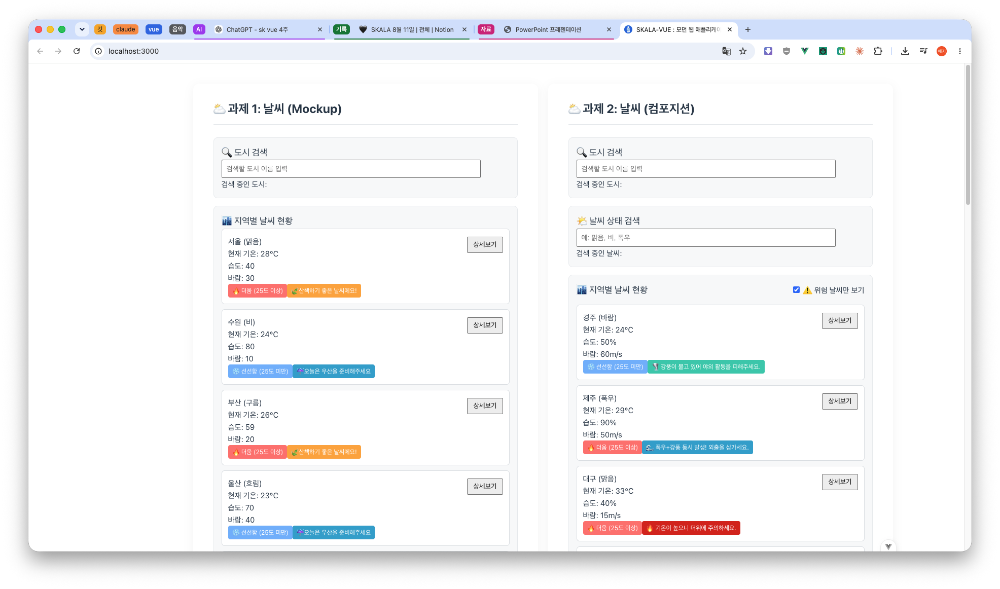
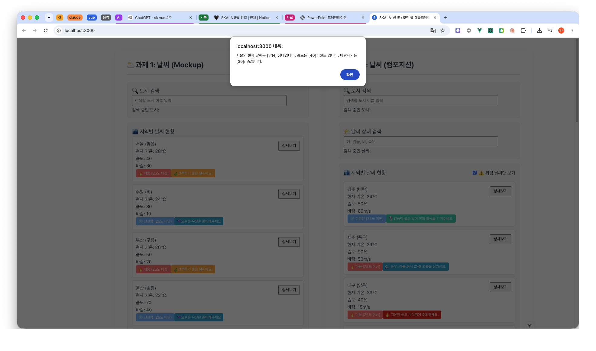
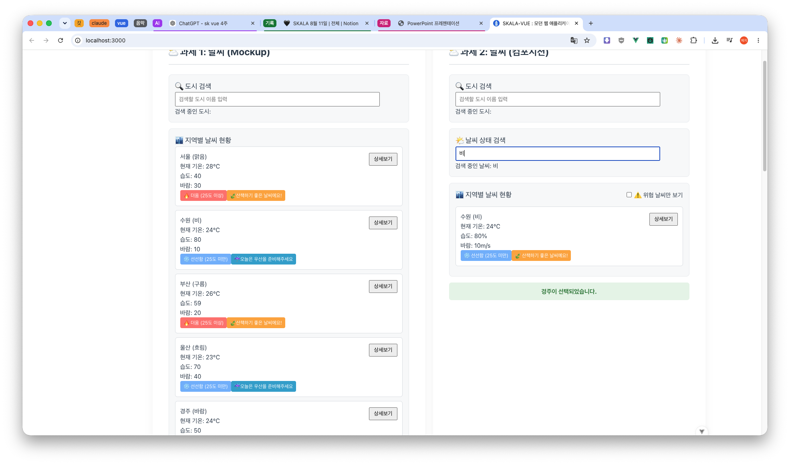

# 🌦️ Weather Mockup & Weather Composition — 개인 커스터마이징 내역

> 교안 기본 요구사항(1~4번: v-for/:key, v-if/v-else, :value·@input, 이벤트·수식어)은
> 스킵하고 **자율적으로 추가·확장한 부분(5번 요구사항)만** 정리했습니다.

---

## 1. Weather Mockup — 나만의 확장

### 1) 데이터 모델 확장

- 예제(id, name, temp, status) 4개 필드에 `humidity`(습도), `windSpeed`(바람 세기) 2개 필드를 추가했습니다.
- 도시 수를 예제 3개 → **6개(서울, 수원, 부산, 울산, 경주, 제주)** 로 확장했습니다.

```js
{ id: 'city_04', name: '울산', temp: 23, status: '흐림', humidity: 70, windSpeed: 40 }
```

### 2) 활동 추천 배지 로직 추가

- 온도 기반 더움/선선함 배지 외에, **습도·바람 세기를 조합한 2차 조건부 배지**를 `v-if / v-else-if / v-else` 3단 분기로 추가했습니다.

| 조건                  | 배지                   |
| --------------------- | ---------------------- |
| 습도 ≥ 60 & 바람 ≤ 50 | ☔️ 우산을 준비해주세요 |
| 습도 ≤ 60 & 바람 ≥ 50 | 🌪️ 외출을 자제해주세요 |
| 그 외                 | 🍃 산책하기 좋은 날씨  |

### 3) 상세보기 alert 정보량 확장

- `showDetail()` 함수에 습도·바람 세기 값을 추가로 넘겨, 클릭 시 노출되는 정보를 온도/상태 2개 → **온도/상태/습도/바람 4개 항목**으로 확장했습니다.

---

## 2. Weather Composition — 나만의 확장

### 1) 반응형 상태 변수 추가

- `statusQuery` — 날씨 상태(맑음/비/폭우 등) 검색용 인풋
- `showDangerOnly` — 위험 날씨만 필터링하는 체크박스 상태

### 2) Computed 2단 계층 구조 설계

- 요구사항은 도시 이름 검색 computed(`filteredWeatherList`) 1개만 요구했지만, 그 위에 **위험 날씨 필터를 한 번 더 적용하는 `displayWeatherList` computed를 추가**로 쌓아 두 단계로 구성했습니다.
- `filteredWeatherList`도 도시 이름뿐 아니라 **날씨 상태 검색어와 AND 조건으로 결합**하도록 확장했습니다.

```js
// 1단계: 도시명 + 날씨상태 이중 검색
const filteredWeatherList = computed(() => { ... cityMatch && weatherMatch ... })

// 2단계: 1단계 결과 위에 위험 날씨만 필터링
const displayWeatherList = computed(() => { ... filteredWeatherList.value.filter(...) ... })
```

### 3) Watcher 추가

- 요구사항에 명시된 `selectedCityInfo` watch 외에, **`showDangerOnly`를 감시하는 watcher를 추가**하여 필터 ON/OFF 시점을 콘솔에 로그로 남기도록 했습니다.

### 4) 검색 UX 확장 (이중 검색 입력창 + 바인딩 방식 의도적 병행)

- 도시 이름 검색창과 별개로 **날씨 상태 검색창(🌤️ 날씨 상태 검색)을 하나 더 추가**했습니다.
- 두 검색창의 바인딩 방식을 일부러 다르게 구현했습니다.
  - 도시 이름 검색(`searchQuery`): Mockup부터 이어온 `:value` + `@input` 수동 구현을 유지, v-model의 내부 동작 원리를 보여주기 위한 용도.
  - 날씨 상태 검색(`statusQuery`): 새로 추가하는 입력이라 원리 시연 목적이 없으므로, 실무 스타일에 맞게 `v-model`로 간결하게 구현.

```html
<!-- 도시 검색: 원리 시연용 (:value + @input) -->
<input type="text" :value="searchQuery" @input="(e) => (searchQuery = e.target.value)" placeholder="검색할 도시 이름 입력" />

<!-- 날씨 상태 검색: 실전 스타일 (v-model) -->
<input type="text" v-model="statusQuery" placeholder="예: 맑음, 비, 폭우" />
```

- 지역별 날씨 현황 상단에 **"⚠️ 위험 날씨만 보기" 체크박스**를 추가해 실시간 필터링이 가능하도록 했습니다.
- 검색/필터 결과가 0건일 때 "😭 조건에 맞는 날씨가 없습니다" 안내 문구를 스타일과 함께 노출하도록 구현했습니다.

### 5) 위험 날씨 추천 로직 고도화 (단일 조건 → 복합 조건 기반 우선순위 설계)

- 처음에는 폭우 / 강풍 / 고온을 각각 **독립된 단일 조건**으로만 판별했습니다. 하지만 실제 기상 위험은 여러 요인이 겹칠 때 훨씬 심각해지므로(예: 폭우+강풍 = 태풍급 상황, 고온+고습 = 체감온도 급상승), **두 가지 이상의 조건을 `&&`로 결합한 복합 조건**을 추가해 우선순위 체인을 다시 설계했습니다.
- 설계 원칙: **복합 위험은 항상 같은 계열의 단일 위험보다 위 순위**에 배치한다. (그래야 폭우+강풍 상황에서 "강풍" 배지 하나만 뜨고 끝나는 정보 손실을 막을 수 있음)

| 우선순위 | 조건                                   | 배지                                         | 설계 근거                                                                                                       |
| -------- | -------------------------------------- | -------------------------------------------- | --------------------------------------------------------------------------------------------------------------- |
| 1순위    | `status === '폭우' && windSpeed >= 50` | 🌊 폭우+강풍 동시 발생! 외출을 삼가세요      | 태풍급 복합 재해 — 단일 요인보다 압도적으로 위험                                                                |
| 2순위    | `status === '폭우'`                    | 🌧️ 폭우가 예상되니 외출을 자제해주세요       | 침수·시야 확보 문제                                                                                             |
| 3순위    | `windSpeed >= 50 && temp >= 30`        | 🌪️🔥 강풍+고온 동시! 열사병·낙하물 모두 주의 | 탈진 위험과 낙하물 위험이 중첩                                                                                  |
| 4순위    | `windSpeed >= 50`                      | 🌪️ 강풍이 불고 있어 야외 활동을 피해주세요   | 단독 강풍                                                                                                       |
| 5순위    | `temp >= 30 && humidity >= 70`         | 🥵 고온다습! 체감온도 주의                   | 기상청 체감온도(열지수) 산정 원리를 단순화해 반영 — 습도가 높으면 땀 증발이 어려워 같은 온도라도 더 덥게 느껴짐 |
| 6순위    | `temp >= 30`                           | 🔥 기온이 높으니 더위에 주의하세요           | 단독 고온                                                                                                       |
| 그 외    | 위 조건 모두 미해당                    | 🍃 산책하기 좋은 날씨예요                    | 정상                                                                                                            |

```html
<span v-if="item.status === '폭우' && item.windSpeed >= 50" class="badge recommend-rain">🌊 폭우+강풍 동시 발생! 외출을 삼가세요.</span>
<span v-else-if="item.status === '폭우'" class="badge recommend-rain">🌧️ 폭우가 예상되니 외출을 자제해주세요.</span>
<span v-else-if="item.windSpeed >= 50 && item.temp >= 30" class="badge recommend-wind">🌪️🔥 강풍+고온 동시! 열사병과 낙하물 모두 주의하세요.</span>
<span v-else-if="item.windSpeed >= 50" class="badge recommend-wind">🌪️ 강풍이 불고 있어 야외 활동을 피해주세요.</span>
<span v-else-if="item.temp >= 30 && item.humidity >= 70" class="badge recommend-overhit">🥵 고온다습! 체감온도가 더 높으니 수분 섭취에 유의하세요.</span>
<span v-else-if="item.temp >= 30" class="badge recommend-overhit">🔥 기온이 높으니 더위에 주의하세요.</span>
<span v-else class="badge recommend">🍃 산책하기 좋은 날씨예요!</span>
```

---




